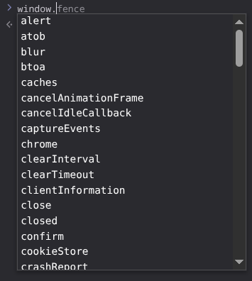

#programming 
Setiap _browser_ menyediakan apa yang disebut Browser Object Model atau BOM yang bisa kita gunakan dalam kode JavaScript kita. Dalam _browser_, BOM ini diwakilkan oleh sebuah objek bernama _window_. Mari kita ketik _window_ pada _console_ _browser_ dan lihat _method_ dan _method_ apa saja yang tersedia melalui objek ini:

Melalui objek _window_ inilah kode JavaScript kita bisa mengakses berbagai _method_ dan atribut yang bisa membantu kita membuat halaman _web_ menjadi lebih interaktif. Kemungkinan Anda akan tertegun melihat begitu banyak _method_ serta atribut. Akan tetapi, Anda tidak diharapkan untuk menghafal semuanya karena pada materi berikutnya kita cukup membahas 3 method paling dasar yakni `alert()`_,_ `prompt()`, dan objek `console`.

