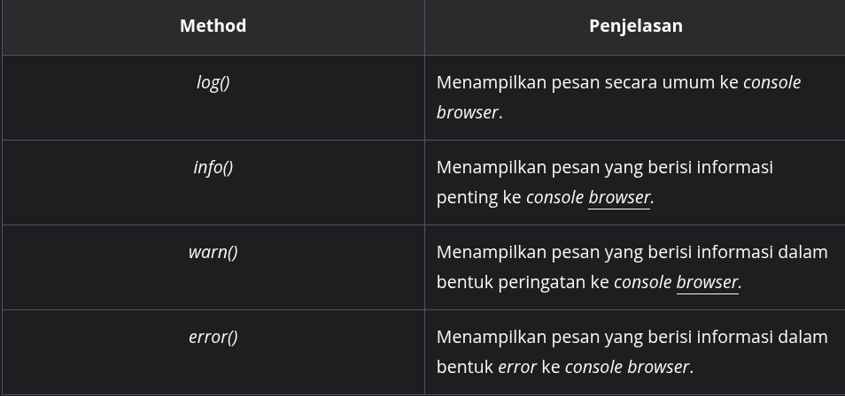
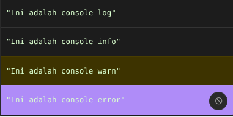

#programming 
Objek ini merupakan peralatan yang wajib diketahui oleh semua Front-End Web Developer. Mengapa demikian? Hal ini karena objek `console` memberikan kita akses ke fitur _debugging_ alias peralatan-peralatan yang bisa membantu menghilangkan _bug_ yang bersembunyi di dalam kode JavaScript.

Tentunya, Anda masih ingat, kan? Jika ingin menampilkan sebuah nilai ke console browser, kita dapat menggunakan method `log()`.

```js
console.log('Pesan kamu');
```

Wah, ternyata kita sudah menggunakan objek _`console`_ sejak awal! Melalui objek `console` ini, kita dapat membuat kode JavaScript menampilkan pesan-pesan khusus berdasarkan konteks tertentu pada _console_ _browser_. Berikut beberapa _method_ dari objek `console` yang umum digunakan:


```js
console.log('Ini adalah console log');
console.info('Ini adalah console info');
console.warn('Ini adalah console warn');
console.error('Ini adalah console error');
```


