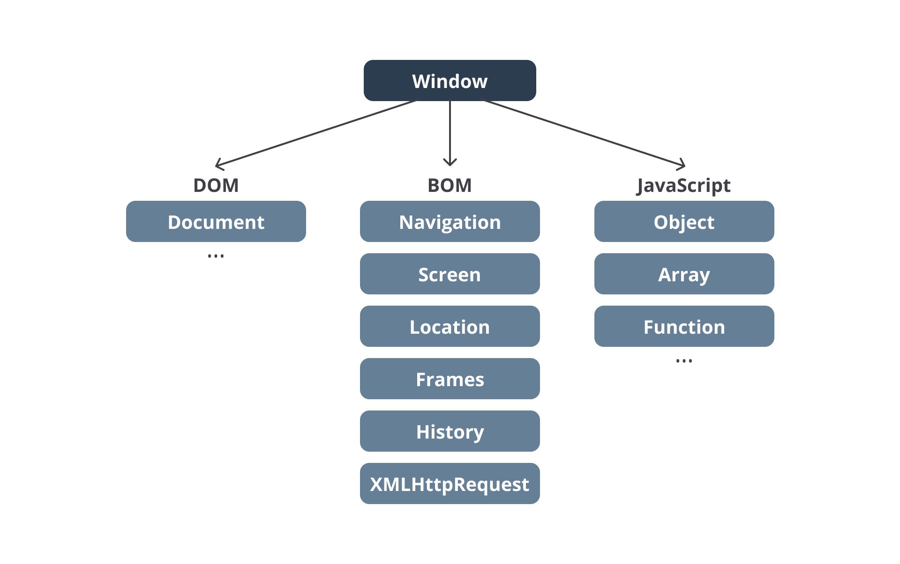

#programming 
Selama belajar materi JavaScript yang dibahas di dalam kelas ini, apakah Anda menyadari semua kode JavaScript berjalan di perangkat browser dan tidak pada perangkat lainnya? Mengapa demikian? Karena kita menggunakan _runtime environment_ milik _browser_ alias semua kode JavaScript dijalankan di atas _platform browser_.

Pada awalnya Bahasa Pemrograman JavaScript didesain untuk berjalan di browser. Namun, seiring berjalannya waktu, kini banyak platform yang dapat menjalankan JavaScript di luar browser. Platform tersebut menggunakan _runtime environment_ lain seperti Node JS. Salah satu contohnya adalah ketika kita menjalankan kode JavaScript pada [glot.io](https://glot.io/). 

Walaupun JavaScript dapat berjalan di luar browser, kita perlu tahu bahwa JavaScript yang berjalan di browser memiliki **fungsionalitas khusus** yang tidak bisa ditemukan di tempat lain. Hal tersebut karena ia dijalankan di dalam **browser environment**.

Apa istimewanya _browser environment_ ini? Istimewanya terletak pada "peralatan-peralatan" khusus yang dapat digunakan oleh kode JavaScript untuk berinteraksi dengan browser maupun dengan dokumen HTML yang kita buat. Masih ingat dengan istilah **Browser Object Model** (BOM) dan **Document Object Model** (DOM)? Keduanya secara khusus hanya tersedia untuk JavaScript yang dijalankan dalam _browser environment_.

Pada gambar di bawah ini, kita melihat representasi dari objek window yang hanya bisa diakses oleh JavaScript dalam browser environment. Dengan melalui objek window, kita bisa mengakses DOM serta BOM.

Sehingga, jika kita menjalankan kode JavaScript yang berjalan di luar _browser environment_, maka _browser_ _object_ (`window`) dan _document object_ (`document`) tidak akan tersedia dan menyebabkan error. Sebagai contoh, jika kita menjalankan method `alert()` di environment browser, alert dialog akan muncul. 

Namun, jika menggunakan [glot.io](https://glot.io/), method tersebut akan melemparkan error karena pada situs tersebut (compiler online) kode JavaScript dijalankan di _environment_ NodeJS, yang mana tidak tersedianya **BOM** maupun **DOM**.

Keren, bukan? Dalam pemrograman _front-end_ kita akan sering bergulat dengan BOM serta DOM untuk mempercantik tampilan website.