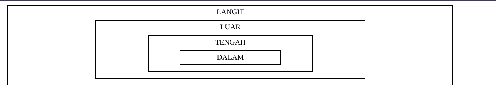

#programming 
Di mana ada event maka kemungkinan ada bubbling dan capturing. Pada kesempatan kali ini, kita akan membahas mengenai apa itu bubbling dan capturing serta mempraktikkannya. Event bubbling maupun capturing termasuk dalam event propagation. Untuk mengetahui lebih lanjut, mari kita bahas event Bubbling dan Capturing pada uraian berikut.

Event Bubbling
Apakah Anda pernah melihat gelembung udara muncul dari dasar minuman bersoda ketika dituang ke sebuah gelas? Pasti gelembung udara tersebut akan bergerak perlahan menuju ke permukaan, bukan? Ingat baik-baik analogi ini bahwa gelembung udara akan selalu naik ya.

Sama halnya dengan gelembung udara, fenomena bubbling adalah ketika sebuah event terjadi pada sebuah elemen, maka event handler milik elemen tersebut akan dijalankan terlebih dahulu yang diikuti event handler elemen parent-nya, dan seterusnya sampai elemen paling atas. Sama seperti fenomena gelembung udara pada minuman bersoda, bukan?

Bagaimana contoh riilnya? Mari kita buat sebuah berkas HTML sederhana yang terdapat pada folder "Bubbling".


Dari hasil yang didapat, silakan klik pada area dari elemen `<div>` dengan isi konten “DALAM” dan perhatikan apa yang terjadi. Ternyata event click terjadi secara bersarang dan menyebabkan alert bermunculan, dimulai dari elemen yang ditarget ketika diklik hingga elemen terluar.

Mengapa berperilaku demikian? Perhatikan kembali setiap tag `<div>` pada berkas HTML di atas. Semua elemen memiliki event handler untuk event onclick. Sesuai dengan penjelasan bubbling, jika kita menekan elemen paling dalam, maka semua event handler akan dijalankan dimulai dari elemen pertama yang di-klik lalu kemudian parent-nya dan seterusnya.

Sekarang coba tekan daerah elemen yang terdapat tulisan “TENGAH”, maka event handler yang dijalankan hanyalah milik elemen tersebut serta parent-parentnya dan tidak termasuk child-nya. Alur tersebut sama seperti prinsip gelembung udara udara yang hanya bergerak ke atas dan tidak ke bawah.


### Event Capturing
Setelah membahas bubbling, mari kita bahas fenomena berikutnya yakni capturing. Capturing merupakan kebalikan dari bubbling yang akan men-trigger event handler dari parent ke child.

Mari kita buat sebuah berkas HTML baru beserta strukturnya seperti pada folder Capturing.


Apakah Anda melihat perubahan? Ternyata hasilnya sama dengan event bubbling.
Sekarang, tambahkan kode bercetak tebal berikut pada parameter ketiga dari addEventListener untuk mengatasi masalah ini. Anda bisa mempraktikkannya pada interactive code di atas.

```js
const divs = document.getElementsByTagName('div');
for (let el of divs) {
  el.addEventListener('click', function() {
    alert('ELEMEN ' + el.getAttribute('id').toUpperCase());
  }, true);
}
```

Kode di atas akan menambahkan event listener melalui addEventListener terhadap semua elemen div pada berkas HTML. Isi dari event handler adalah nama id elemen tersebut diubah semua ke huruf besar. Fungsionalitas sama persis dengan cara yang kita terapkan pada bubbling.html, hanya saja kita menggunakan method addEventListener ketimbang inline.

Kenapa kita menggunakan addEventListener? Hal ini karena kita bisa memberikan satu parameter khusus bernilai boolean ke parameter ke-3 seperti yang ditunjukkan kode yang dicetak tebal di atas, yaitu true.

Perhatikan ketika kita klik sebuah elemen, maka dialog box alert yang muncul dimulai dari elemen paling luar dan berhenti di elemen yang kita tekan. Persis dengan kebalikan dari bubbling, bukan?