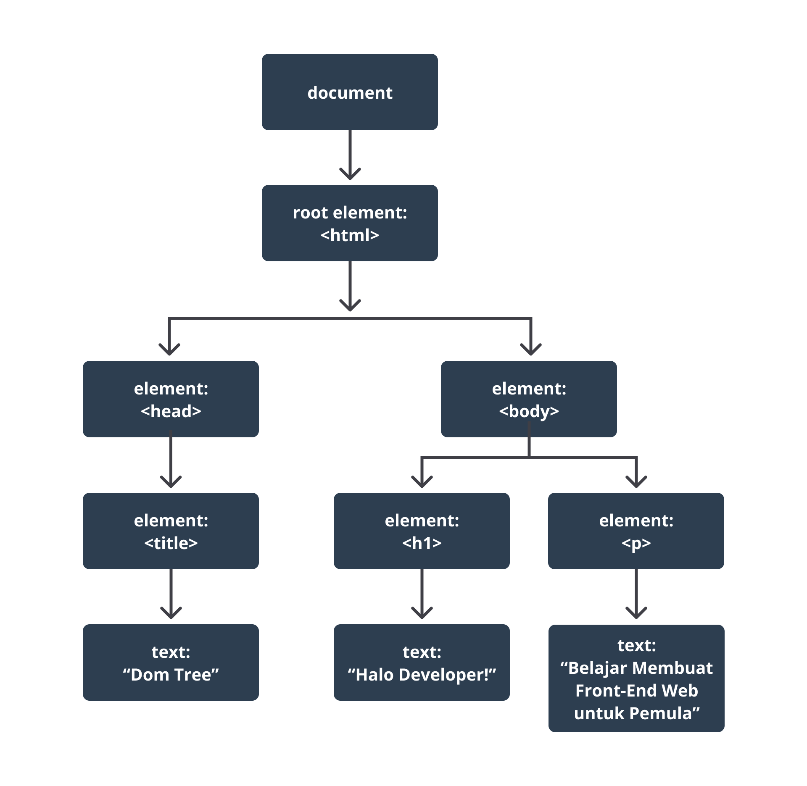
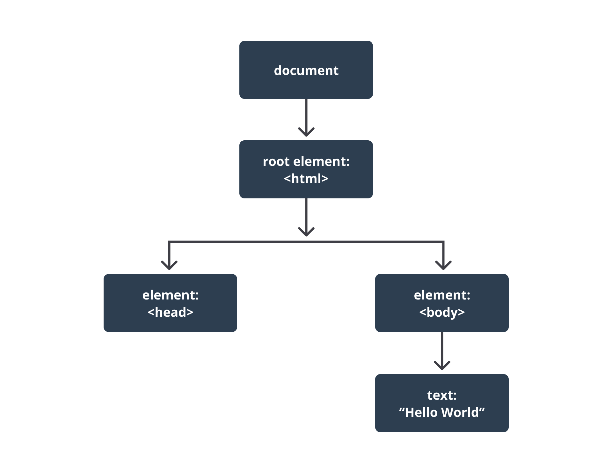

#programming 
_Tree_ yang dimaksud di sini adalah nama dari sebuah struktur data pada komputer yang secara visual mirip seperti sebuah pohon. Struktur data ini disebut _tree_, karena layaknya pohon terdapat satu batang induk tunggal yang kemudian bercabang menjadi batang-batang lainnya dan bisa saja bercabang kembali. Jika batang tersebut _buntu_, maka ujungnya terdapat daun (pada struktur data _tree_, daun disebut sebagai _node_).

Pada berkas HTML, batang induk tunggal adalah elemen `<html>`, sedangkan cabang-cabangnya adalah elemen-elemen yang terdapat di dalamnya. Misalkan kita mempunyai berkas HTML dengan struktur HTML berikut.

```html
<!DOCTYPE html>
<html>
	<head>
		  <title>DOM Tree</title>
	</head>
	<body>
		  <h1>Hello Developer Front-End Web!</h1>
		  <p>Belajar Membuat Front-End Web untuk Pemula</p>
	</body>
</html>
```

Jika kita buat berkas HTML di atas menjadi dalam bentuk **DOM**, strukturnya akan menjadi seperti berikut.



Pada contoh yang diberikan di atas, DOM memiliki bentuk struktur data _tree_ yang dibuat berdasarkan berkas HTML di atas. Struktur data _tree_ di atas inilah yang akan direpresentasikan dalam bentuk global obyek bernama **document** nanti.

Walaupun struktur dari DOM terbentuk berdasarkan isi dari berkas HTML, tetapi ada beberapa skenario tertentu yang menyebabkan struktur DOM berbeda dengan struktur elemen-elemen dalam berkas HTML. Salah satu skenarionya adalah jika terdapat kesalahan penulisan dalam berkas HTML. Mari kita lihat contohnya seperti berikut:

```html
<!DOCTYPE html>
<html>
  Hello World!
</html>
```

Pada berkas HTML di atas, jelas terlihat bahwa tidak ada elemen dengan _tag_ `<head>` maupun `<body>` yang mengakibatkan berkas HTML tersebut tidak valid. Walaupun berkas HTML tersebut tidak valid pada bentuk DOM-nya, _object structure_-nya akan diperbaiki. Bagaimana caranya? Caranya yakni elemen dengan _tag_ `<head>` maupun `<body>` akan ditambahkan secara otomatis kemudian teks “Hello World!” ditempatkan di elemen `<body>`.



