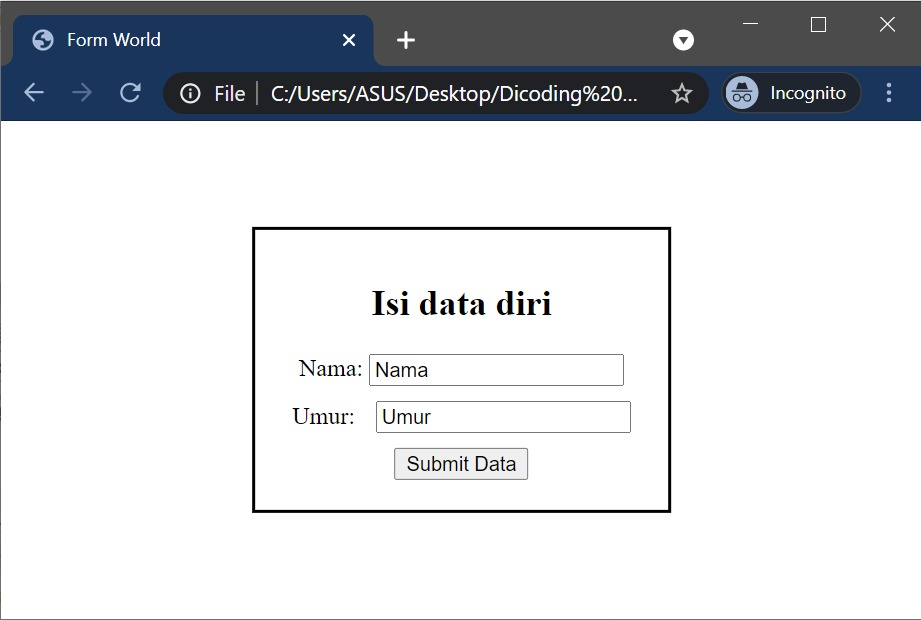

#programming 
Sejauh ini kita sudah mempelajari bagaimana cara menambahkan aspek interaktif dari halaman _web_, terutama mengubah _layout-_nya_._ Sebelum kita menyelesaikan modul ini, ada satu jenis elemen HTML yang sangat sering digunakan untuk mengumpulkan banyak input dari _user_ sekaligus. Kita sudah pernah menyebutnya pada materi-materi sebelumnya tetapi hanya sekadar menyebutnya. Ia adalah **Form**.

_Form_ umumnya digunakan untuk menangkap input dari user dalam jumlah banyak sekaligus. Bisa ditebak dari namanya pasti bentuk form akan mirip seperti formulir.

Lengkap, bukan? Ada field yang bisa diisi dan ada juga tombol bernama "Submit Data" ketika kita sudah selesai mengisi data pada form. Sama halnya dengan elemen HTML pada umumnya, terdapat beberapa event yang dihasilkan oleh form yang akan kita terapkan pada praktik. Untuk penjabarannya, perhatikan tabel di bawah ini:

<table>
  <thead>
    <tr>
      <th>Nama Event</th>
      <th>Penjelasan</th>
    </tr>
  </thead>
  <tbody>
    <tr>
      <td>onsubmit</td>
      <td>Event ini akan terjadi ketika kita menekan tombol submit milik sebuah form</td>
    </tr>
    <tr>
      <td>oninput</td>
      <td>Event ini akan terjadi jika kita memberikan input melalui field.</td>
    </tr>
    <tr>
      <td>onchange</td>
      <td>Event ini akan terjadi jika kita sudah selesai memberikan input melalui field. Bisa juga diaplikasikan ke elemen select (dropdown menu).</td>
    </tr>
    <tr>
      <td>oncopy</td>
      <td>Event ini akan terjadi jika kita menyalin (copy) isi dari sebuah elemen.</td>
    </tr>
    <tr>
      <td>onpaste</td>
      <td>Event ini akan terjadi jika kita menempel (paste) isi dari hasil salin (copy) pada sebuah teks.</td>
    </tr>
    <tr>
      <td>onfocus</td>
      <td>Event ini akan terjadi jika sebuah elemen pada form dipilih untuk dilakukan proses input.</td>
    </tr>
    <tr>
      <td>onblur</td>
      <td>Event ini akan terjadi jika sebuah elemen pada form tidak dipilih lagi untuk dilakukan proses input.</td>
    </tr>
  </tbody>
</table>

Sekali lagi, Anda tidak perlu menghafal semua event di atas secara detail. Karena kita akan membahasnya secara rinci serta mempraktikkannya pada materi berikutnya

