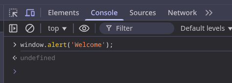

#programming 
Setelah membaca materi sebelumnya, maka akan muncul pertanyaan “Bagaimana JavaScript mengontrol sebuah _website_ atau _browser_?” Jawabannya ada dua, dan keduanya akan kita bahas di modul ini, yakni melalui **Browser Object Model** **(BOM)** dan **Document Object Model (DOM)**.

Yang pertama adalah **BOM**. Dengan **BOM**, kita dapat memberikan perintah-perintah khusus ke browser, misalnya melalui sebuah ‘atribut’ khusus milik browser yakni ‘window’ (akan kita bahas di materi selanjutnya) sehingga kita bisa membuat _browser_ menampilkan pesan pop-up. Caranya yakni menjalankan method `alert()` pada _console_ milik browser. 

Berikut contohnya:

dan akan memunculkan ini:

Selain _method_ `alert()`_,_ objek `window` juga memiliki method-method lainnya, seperti prompt, console, dsb. Tenang, kita akan berjelajah lebih jauh pada modul-modul selanjutnya.

Cara kedua adalah **DOM**. **DOM** sama seperti **BOM**. Perbedaannya adalah kita menggunakan global objek bernama `document`. Melalui global objek ini, kita bisa menangkap seluruh elemen dalam dokumen HTML guna memanipulasi konten HTML melalui method `getElementById()`. Method ini akan menangkap elemen berdasarkan value dari atribut id. Sebagai contoh, kita mengubah konten elemen HTML berikut ini.

kita gunakan perintah 
`document.getElementById('Welcome').innerHTML = 'I love you';`

Sebelumnya Header itu bertulisan "Welcome", yang memiliki id "Welcome" di HTML nya, tapi ketika saya menjalankan code Javascript diatas, maka tulisan header tersebut berganti menjadi "i love you".

Pada contoh yang kita pelajari di atas merupakan contoh yang sangat sederhana. Kita dapat melakukan lebih banyak hal lainnya, seperti mengubah konten elemen, memberikan event tertentu pada elemen, dan sebagainya.

Melalui contoh di atas, kita telah menggunakan console milik browser untuk menjalankan kode program JavaScript. Tentunya jika kita mengembangkan website tidak menggunakan pendekatan seperti ini. Ada cara lain dalam menulis kode JavaScript, yakni melalui berkas HTML secara langsung.