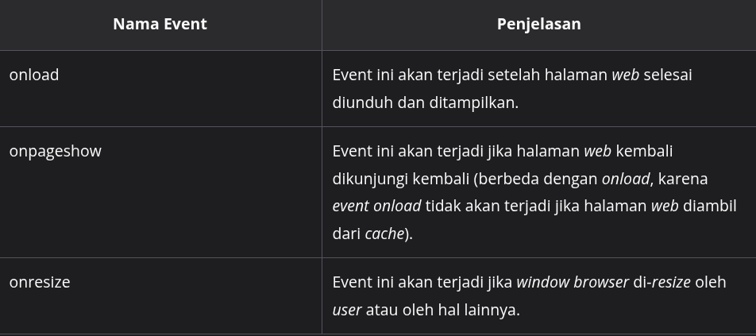
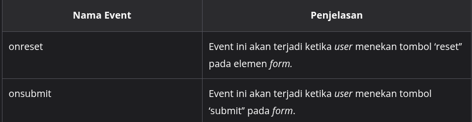
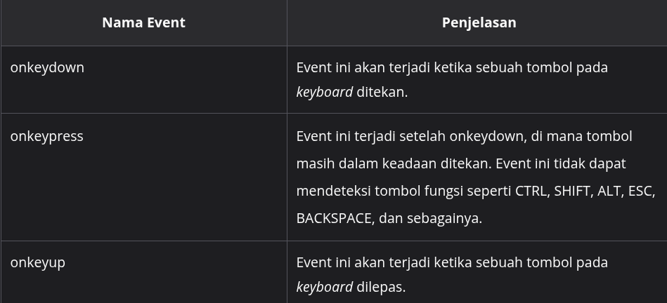
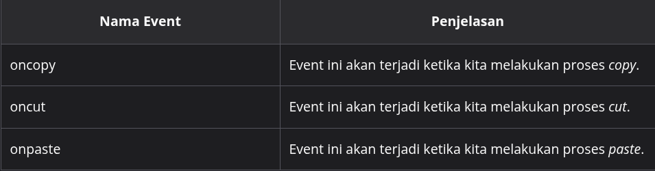
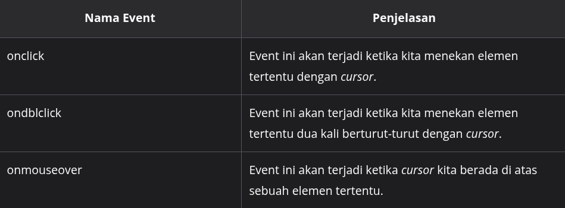

#programming 
Walau istilah event terkesan sangat abstrak, kita dapat menggolongkan beberapa event menjadi beberapa kategori berdasarkan sumber dari mana event tersebut terjadi. Contohnya kejadian yang berhubungan dengan kursor mouse, keyboard, kegiatan _copy_ sebuah elemen teks pada berkas HTML, atau bahkan dari ukuran _window browser_.

Berikut beberapa pembahasan terhadap kategori umum serta beberapa event-event yang tergolong pada kategori tersebut.

### Window Events
Window Events adalah kejadian-kejadian yang berasal dari browser alias pada window.

### Form Events
_Form Events_ adalah kejadian-kejadian yang berasal dari sebuah elemen HTML dengan _tag_ `<form>`

### Keyboard Events
_Keyboard Events_ adalah kejadian-kejadian yang berasal dari ditekan atau dilepasnya tombol pada _keyboard._

### Clipboard Events
_Clipboard Events_ adalah kejadian-kejadian yang berasal dari proses _cut, copy,_ atau _paste_ sebuah elemen._._

### Mouse Events
Mouse Events adalah kejadian-kejadian yang berasal dari kegiatan klik mouse.
