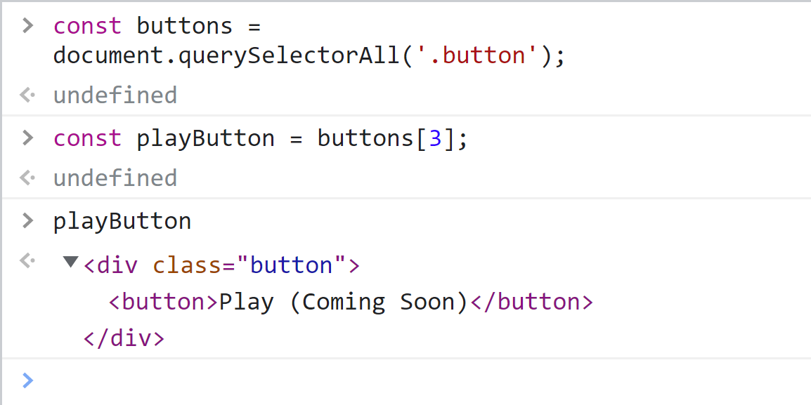
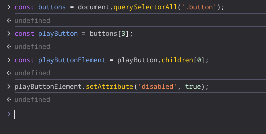
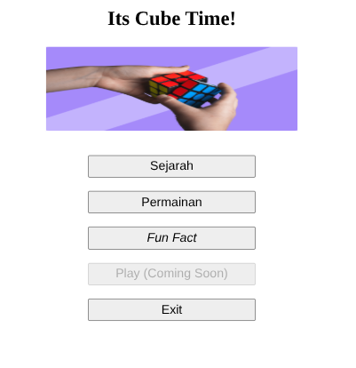

#programming 

Kita bisa memanipulasi elemen HTML yang kita tangkap melalui DOM. Salah satunya adalah atribut. Method yang digunakan untuknya adalah `setAttribute()` yang dipanggil dari elemen yang telah ditangkap.

```js
element.setAttribute('nama_atribut_sasaran', 'nilai_atribut_sasaran');
```

Kita ambil contoh halaman _web_ yang sudah kita praktikan pada awal sub-modul sebelumnya.

Tampaknya ada berapa kejanggalan yang bisa kita perbaiki supaya tampilan halamannya lebih keren, yakni:

- Menyesuaikan ukuran gambar yang terlalu kecil.
- Menonaktifkan _button_ ke-4 (Play (Coming Soon)).

Baiklah, sepertinya kita bisa mengubah atribut-atribut dari elemen-elemen tersebut. Mari kita mulai dengan mengubah dimensi pada gambar terlebih dahulu, melalui atribut _width_ dan _height_-nya dengan nilai masing-masing "300" dan "215". Silakan jalankan kode berikut ini.

```js
.setAttribute('width', 300);
.setAttribute('height', 215);
```

Berikutnya adalah mengubah tombol yang memiliki _caption_ "Play (Coming Soon)".

Kali ini, kita tidak bisa mengakses tombol Play Coming Soon melalui _method_ `getElementById()` karena elemen ini tidak memiliki atribut id yang unik. Lalu, bagaimana kita menyelesaikan masalah ini? Tenang, masih ada satu _method_ yang bisa kita gunakan. Masih ingat dengan _method_ `querySelectorAll()` yang kita pelajari pada materi "Mencari DOM (Mendapatkan DOM)", kan? Yup, kita bisa menggunakan method tersebut untuk mendapatkan semua _button._ Jika kita ingat, setiap elemen `<div>` memiliki atribut class dengan value "button" sehingga kita bisa menangkap elemen button dengan cara berikut.

```js
const buttons = document.querySelectorAll('.button');
```

tetapi kita belum mendapatkan elemen tombol yang kita inginkan. Hal ini karena kita menangkapnya menggunakan method `querySelectorAll()`. Bagaimana kita bisa melanjutkan tugas kita? Coba ingat-ingat kembali pada materi "Mencari DOM (Mendapatkan DOM)". Bukankah HTMLCollection bisa kita akses elemen-elemennya seperti layaknya sebuah _array?_ Nah, kuncinya adalah mengambil tombol "Play (Coming Soon)" melalui _indexing_!

Karena tombol yang kita tuju adalah tombol ke-4 (pada _array_ _buttons_ terletak pada indeks ke-3), cara mengaksesnya seperti berikut.
```js
const playButton = buttons[3];
```

Mantap! Kita selangkah lebih dekat untuk mendapatkan solusinya. _Eits,_ tunggu dulu, coba perhatikan elemen yang disimpan pada variabel _playButton_ berikut.


Kita baru hanya mendapatkan elemen `<div>`, sedangkan kita hanya ingin mengakses elemen _button_. Lantas bagaimana caranya? Kita bisa menggunakan properti `children` yang akan mengembalikan semua _child element_ yang terdapat di dalam _tag_ `<div>` dalam bentuk HTMLCollection. Karena elemen tersebut hanya memiliki satu child element, kita bisa memanggilnya dengan indeks 0.

```js
const playButtonElement = playButton.children[0];
```

Nah, sampai saat ini kita bisa memanggil _method_ `setAttribute()` pada elemen button yang dituju. Di sini kita akan mengubah type dari tombol yang ber-caption "Play (Coming Soon)" menjadi `disabled`.

```js
.setAttribute('disabled', true);
```

jika di jalankan dengan console browser:

jika di jalankan dengan code js:
```js
const buttons = document.querySelectorAll('.button')[3].children[0];
buttons.setAttribute('disabled', true);
```



### JavaScript Automatic Type Conversion pada _setAttribute()_

Jika kita perhatikan pada contoh mengubah atribut "width" maupun "height", parameter kedua menggunakan _string_ yang berisi angka. Namun, apakah Anda mengetahui bahwa kita juga bisa memasukkan tipe data _Number_ daripada _string_? Jika nilai dari sebuah atribut hanya terdiri dari angka saja (contohnya nilai dari _width_ dan _height_ di atas), maka kode:
```js
gambar.setAttribute('width', '300');
```

akan memiliki hasil yang sama dengan:
```js
gambar.setAttribute('width', 300);
```

Mengapa hal ini diperbolehkan? Semua ini memungkinkan karena JavaScript memiliki fitur yang bernama _automatic type conversion_ yang mengkonversi sebuah nilai jika dibutuhkan.
