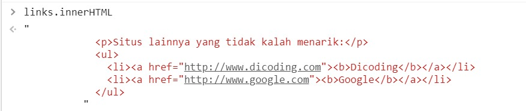
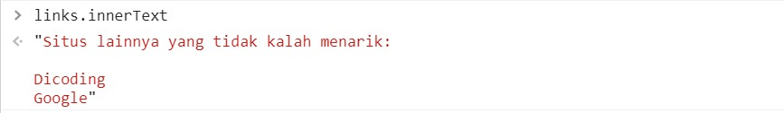
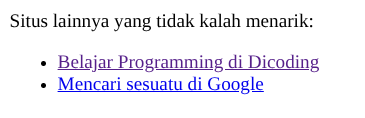
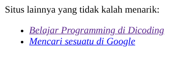
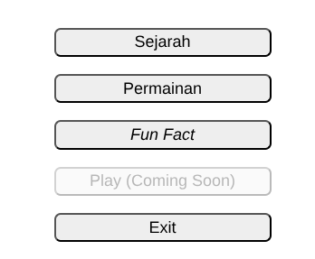

#programming 
JavaScript mampu mengubah atribut dari sebuah elemen. Namun, ada satu kemampuan JavaScript yang tidak kalah hebat, yakni memanipulasi konten atau isi elemen itu sendiri. Terdapat beberapa cara untuk memanipulasi konten elemen seperti `innerText`, `innerHTML` dan `style.property`.

kita akan praktek dengan menggunakan code sebelumnya, dengan sedikit penambahan pada code berikut
```js
<hr size="2" width="95%" color="black">
<div id="links">
  <p>Situs lainnya yang tidak kalah menarik:</p>
  <ul>
    <li><a href="http://www.dicoding.com" id="dicodingLink">Dicoding</a></li>
    <li><a href="http://www.google.com" id="googleLink">Google</a></li>
  </ul>
</div>
```

### Perbedaan _innerText dan_ _innerHTML_

Coba perhatikan isi dari berkas HTML di atas, terdapat sebuah elemen` <div> `dengan atribut id  dengan value "links" yang berisi pranala-pranala eksternal. Dari sini, kita akan coba melihat perbedaan antara innerHTML vs. innerText dalam elemen `<div> `tersebut. Pertama, kita akses elemen tersebut dengan memanggil method getElementById().

```js
const links = document.getElementById('links');
```

Kemudian jika kita panggil properti innerHTML, maka berikut tampilan output-nya:


Sedangkan jika kita panggil properti innerText, maka hasilnya seperti berikut.


Apakah Anda melihat kemiripannya? Ya, pada kedua properti tersebut mengeluarkan isi konten elemen yang dituju. Lalu, apa perbedaannya? Perbedaannya adalah innerHTML mengambil semua konten dalam sebuah elemen beserta tag-tag HTML yang ada, sedangkan innerText hanya mengambil teks tanpa tag-tag HTML yang ada.

## Manipulasi Konten dengan _innerText_
_Hmmm_ setelah kita telaah, ternyata nama-nama pranala di atas kurang menarik, bagaimana jika kita ubah teks yang ditampilkan tanpa menambahkan _tag-tag_ baru? Jika kita hanya ingin mengubah teksnya saja. maka gunakan _assignment_ terhadap `innerText`.

Misalnya pada halaman web di atas kita ingin mengubah teks "Dicoding" menjadi "Belajar Programming di Dicoding". Maka kita bisa memanggil elemen tersebut terlebih dahulu, lalu memasukkan string "Belajar Programming di Dicoding" melalui pemanggilan properti `innerText` sebagai berikut.

pertama, kita harus mengambil elemen terlebih dahulu. Pada pranala Dicoding, id-nya adalah "dicodingLink", sedangkan pada Google, id-nya adalah "googleLink". Namun, pada praktik kali ini kita hanya mencoba mengubah isi pada pranala Dicoding dahulu
```js
const dicoding = document.getElementById('dicodingLink');
```

kedua, tinggal manipulate dengan inner.Text:
```js
dicoding.innerText = 'Belajar Programming di Dicoding';
```

dan tulisannya berhasil di ubah yang tadinya 'dicoding', menjadi 'Belajar Programming di Dicoding.

 Silakan Anda terapkan hal di atas untuk pranala Google, di mana pesan pada pranalanya diubah menjadi "Mencari sesuatu di Google". Ingat, nilai _id_ pada pranala Google adalah "googleLink".


 
## Manipulasi Konten dengan _innerHTML_

Kita sudah mengetahui bahwa `innerHTML` mengembalikan konten sebuah elemen beserta _tag_ HTML-nya. Apakah Anda bisa menebak apa kegunaan fungsionalitas ini? Kuncinya terletak pada kata _tag_. Sudah tahu? Betul, dengan melakukan _assignment_ ke properti ini kita bisa menyertakan tag HTML dan merendernya dengan mudah melalui string.

Sekarang kita akan berlatih memanipulasi konten dengan `innerHTML`. buka kembali berkas .html yang sudah pernah dibuat sebelumnya.

Di sini kita akan coba ubah konten HTML pada tulisan pranala Dicoding dan Google sehingga tulisan yang muncul akan miring alias italic. Caranya, tambahkan tag `<i>` di antara teksnya.

Kita sebelumnya sudah menyimpan elemen dengan atribut id dengan value "dicodingLink" yang disimpan pada variabel "dicoding", maka kita tinggal memanggil atribut innerHTML pada variabel tersebut.

```js
dicoding.innerHTML = '<i>Belajar Programming di Dicoding</i>';
```

Kemudian lihat bahwa sekarang pranala yang mengandung tulisan "Belajar Programming di Dicoding" akan memiliki gaya font miring alias italic.



Jelas fungsionalitasnya lebih banyak ketimbang innerText karena kita bisa menyematkan teks beserta tag HTML nya yang akan diproses sebagai tag HTML seperti aslinya. Jika Anda melakukan assignment dengan string "<i>Belajar Programming di Dicoding</i>" menggunakan innerText, maka teks akan muncul beserta tag HTML-nya. Sedangkan jika menggunakan innerHTML akan menjadi seperti output diatas.

## Manipulasi Style Konten dengan style.property

Sebelumnya, kita sudah bisa memanipulasi atribut element dengan method setAttribute, mengubah isi konten elemen dengan properti innerText dan innerHTML. Sebelum menyelesaikan materi ini, kita akan belajar mengubah styling sebuah elemen.

Lalu, bagaimana caranya jika kita ingin membuat tombol-tombol kita memiliki pojok-pojok yang jelas? Kita dapat mengubah styling pada tombol-tombol tersebut menggunakan sintaks style.property. Pada kasus ini, kita ingin menambahkan style berupa border-radius dengan nilai "4px" dari semua button di atas.

Langkah pertama adalah mendapatkan semua elemen button terlebih dahulu. Awalnya kita dapat menggunakan method querySelectorAll(). Bagaimana jika kita bereksperimen dan menggunakan method lain? 

Kali ini, mari kita coba gunakan method getElementsByClassName(). Silakan jalankan kode berikut.

```js
const buttons = document.getElementsByClassName('button');
```

Nah, karena kita tidak menggunakan method querySelector dan querySelectorAll, kita tidak perlu menuliskan selector sebagaimana CSS. Namun, kita bisa memanggil elemen dengan menyebut value dari atribut class yang dituju. Setelah itu, kita akan mendapatkan HTMLCollection, yang mana akan kita lakukan looping terhadapnya. Setiap iterasi yang terjadi, elemen yang didapatkan memiliki properti children yang mengembalikan HTMLCollection, yaitu satu elemen `<button>`. Untuk mengaksesnya adalah memanggil properti children di dalam looping tersebut dan mengambil child element pertama dengan cara indexing, yaitu `button.children[0]`. Silakan jalankan kode berikut.
```js
for (const button of buttons) {
  console.log(button.children[0]);
}
```

Setelah mendapatkan elemen yang dituju (button), kita bisa mengakses memanggil objek style dan diikuti nama properti CSS untuk melakukan perubahan style button.
```js
for (const button of buttons) {
  button.children[0].style.borderRadius = '6px';
}
```



Lho? Styling yang kita ingin ubah pada asalnya bernama "border-radius", tapi kenapa menjadi "borderRadius"? Singkatnya, nama properti dari objek DOM mengikuti standar penamaan variabel khusus. Penamaannya tidak boleh mengandung tanda "-". Sehingga, nama properti CSS yang memiliki tanda "-" diubah menjadi bentuk camelCase. Contohnya border-radius menjadi borderRadius, font-family menjadi fontFamily, font-size menjadi fontSize, dan seterusnya.
