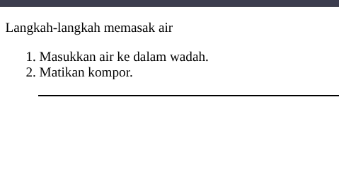
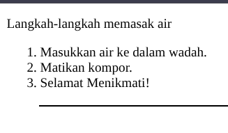

#programming 
Pada sub-modul sebelumnya, kita sudah belajar bagaimana cara membuat konten HTML dan memanipulasi konten HTML sehingga dapat berubah "bentuk". Namun, bagaimana jika kita ingin menambahkan elemen HTML yang benar-benar baru? Pada materi ini kita akan mempelajarinya melalui 2 method yakni appendChild() dan insertBefore().

Seperti biasanya, kita akan membuat sebuah berkas HTML terlebih dahulu. Silakan membuat berkas HTML dan strukturnya sebagai berikut.

```html
<!DOCTYPE html>
<html>
  <head>
    <title>Memasak Air</title>
  </head>
  <body>
    <p id="name">Langkah-langkah memasak air</p>
    <ol id="daftar">
      <li id="awal">Masukkan air ke dalam wadah.</li>
      <li id="akhir">Matikan kompor.</li>
    </ol>
    <hr size="2" width="95%" color="black">
  </body>
</html>
```

Jika dijalankan melalui browser, maka hasilnya seperti ini.


## Menambahkan Elemen dengan appendChild()
Apa fungsi dari method appendChild? Fungsinya adalah menambahkan atau menyisipkan sebuah child elemen ke bagian akhir dari sebuah elemen.

Pada berkas HTML di atas, kita ingin menambahkan langkah baru yakni sebuah pesan berisi "Selamat menikmati!". Rasanya kurang lengkap jika suatu resep tidak diakhiri dengan pesan tersebut.

Sebelum kita memanggil elemen`<ol>`, bagaimana jika kita membuat sebuah elemen baru terlebih dahulu dengan method createElement(). Elemen yang ingin kita buat adalah elemen `<li>` karena ingin menambahkan item ke dalam ordered list.
```js
const newElement = document.createElement('li');
```

Berikutnya, kita masukkan konten teks "Selamat menikmati!" ke dalam elemen `<li>` tersebut melalui atribut innerText, karena kita hanya ingin memasukkan teks saja tanpa tambahan tag lainnya.
```js
newElement.innerText = 'Selamat menikmati!';
```

Langkah ketiga adalah mendapatkan parent elemen yakni elemen `<ol>`.
```js
const daftar = document.getElementById('daftar');
```

semua itu akan berubah ketika menggunakan method appendChild() pada variabel daftar.
```js
daftar.appendChild(newElement);
```

maka list baru tertambahkan dengan di letakan paling akhir:


## Menambahkan Elemen dengan insertBefore()
Tidak seperti method sebelumnya, method insertBefore() memberikan kemampuan untuk menyisipkan elemen sebelum child elemen tertentu dalam parent element. Method ini menerima dua buah parameter, yaitu (1) elemen baru yang ingin disisipkan dan (2) child element yang akan dijadikan patokan diletakkannya elemen baru. Berkas HTML yang telah kita modifikasi sebelumnya menggunakan method appendChild() memiliki tampilan berikut.

Tunggu dulu, apakah daftar langkah-langkah di atas ada yang aneh? Pada langkah ke-2 bertuliskan "Matikan kompor". Namun, kapan kita menghidupkan kompornya? Tampaknya kita harus menambahkan langkah yang bertuliskan "Hidupkan kompor". Mari kita perbaiki.

Pertama, kita perlu membuat elemen baru dengan createElement(). Elemen yang ingin kita buat adalah `<li>`. Silakan tambahkan kode berikut ini.
```js
const elementAwal = document.createElement('li');
```

Selanjutnya tuliskan pesan "Hidupkan kompor." ke dalam elemen `<li>` melalui atribut innerText karena kita hanya ingin memasukkan teks saja tanpa tambahan tag lainnya.
```js
elementAwal.innerText = 'Hidupkan kompor.';
```

Langkah ketiga adalah mendapatkan parent elemen dari semua elemen `<li>` yakni `<ol>`. Namun, kita sudah mendeklarasi dan menginisialisasi variabel daftar pada praktik method appendChild(), maka kita tidak perlu melakukannya lagi.

Pada elemen `<ol>,` kita melihat bahwa child element pertama memiliki atribut id dengan nilai "awal". Untuk menyisipkan elemen baru pada posisi awal, kita perlu mengangkat elemen yang memiliki atribut id dengan value "awal".
```js
const itemAwal = document.getElementById('awal');
```

Langkah terakhir adalah memanggil method insertBefore pada variabel daftar. Method tersebut akan dipanggil melalui parent element. Parameter pertama pada method tersebut diisi dengan elemen baru yang ingin ditambah berdasarkan elemen yang sudah ditentukan di parameter kedua.

```js
daftar.insertBefore(elementAwal, itemAwal);
```

Jika kita jalankan pada browser, maka hasilnya akan seperti berikut..

