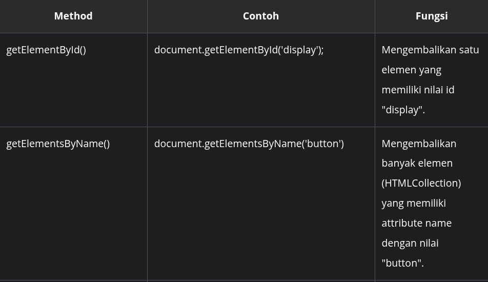
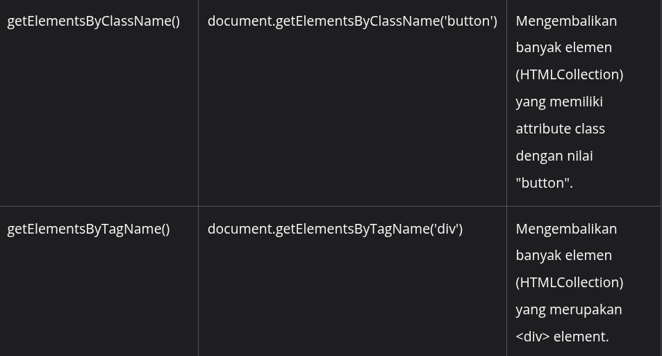
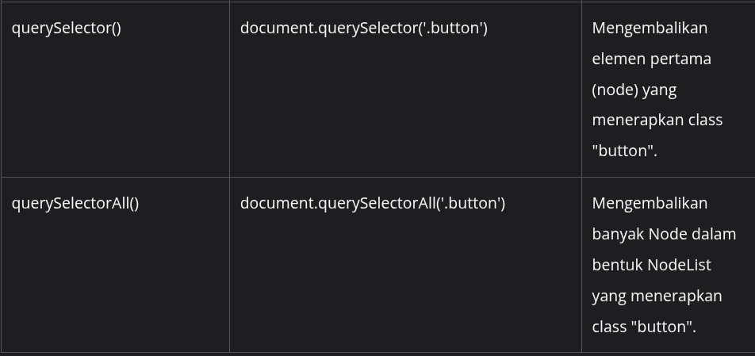

#programming 




Pada methods di atas, ada yang mengembalikan nilai HTML elemen tunggal dan ada juga yang mengembalikan banyak elemen, seperti [HTMLCollection](https://developer.mozilla.org/en-US/docs/Web/API/HTMLCollection) dan [NodeList](https://developer.mozilla.org/en-US/docs/Web/API/NodeList). Karena methods di atas dimiliki oleh objek `document`, jangan lupa mengawali semua pemanggilannya dengan sintaks `document.<nama_method>`, ya.

Ada fakta menarik tentang NodeList, yakni memiliki karakteristik yang mirip dengan array. Contohnya, kita bisa menggunakan properti `length` untuk mendapatkan jumlah elemen yang terdapat di dalamnya. Selain itu, kita bisa mengakses nilai individual elemennya menggunakan indexing.

Karena NodeList memiliki karakteristik yang mirip dengan _array_, maka kita juga bisa melakukan _looping_ terhadap elemen-elemennya, yakni melalui sintaks _looping_ _for of_. implementasinya sebagai berikut.

```js
for (let item of buttons) {
  console.log(item);
}
```

Sesuai dengan namanya, method `querySelector()` dan `querySelectorAll()` membutuhkan query khusus sebagai parameternya. Jika tujuan kita adalah mendapatkan elemen berdasarkan atribut `class`, parameternya harus diawali dengan tanda titik ("."), sedangkan jika berdasarkan atribut `id`, kita harus mengawali nilai parameternya dengan tanda pagar ("#"). Hal ini sama seperti ketika kita bekerja dengan selector di CSS.