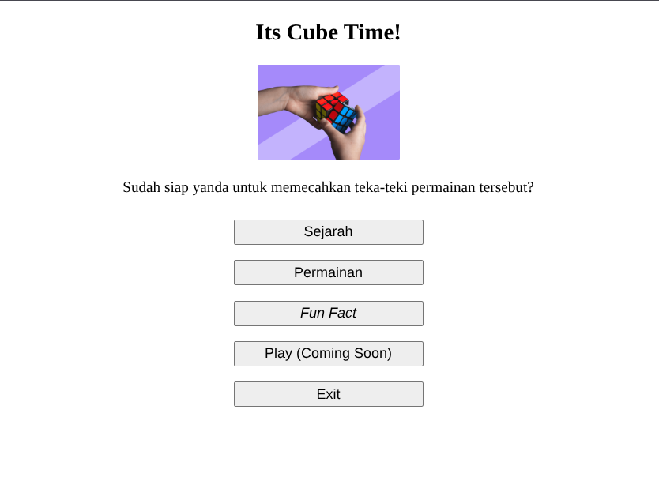

#programming 
Sebelumnya kita sudah belajar bagaimana cara mengakses elemen HTML. Sekarang, kita akan belajar bagaimana cara memanipulasi konten dari elemen yang didapatkan, mulai dari mengubah atribut elemen hingga mengubah konten HTML serta _styling_ yang digunakan.

Pertama, kita buat terlebih dahulu berkas HTML dengan struktur sebagai berikut.
```html
<!DOCTYPE html>
<html>
<head>
  <title>Welcome to Cube World!</title>
  <style>
    button {
      width: 200px;
      font-size: 15px;
      margin: 8px;
      padding: 3px;
    }
  </style>
</head>
<body>
<div align="center">
  <h2>Its Cube Time!</h2>
  
  <p id="caption"><b>Sudah siap untuk memecahkan teka-teki permainan tersebut?</b></p>
  <div class="button-group">
    <div class="button">
      <button>Sejarah</button>
    </div>
    <div class="button">
      <button>Permainan</button>
    </div>
    <div class="button">
      <button><i>Fun Fact</i></button>
    </div>
    <div class="button">
      <button>Play (Coming Soon)</button>
    </div>
    <div class="button">
      <button>Exit</button>
    </div>
  </div>
</div>
</body>
</html>
```

> **Catatan:  
> Pada tag `<div>` terdapat atribut align dengan nilai center yang berfungsi untuk memosisikan seluruh child element berada di tengah-tengah parent element-nya. Namun, penggunaan atribut ini sudah usang (deprecated) sehingga penggunaannya sudah tidak di rekomendasikan kembali. Solusinya adalah menuliskan aturan styling menggunakan CSS.

Jika kita jalankan dokumen HTML tersebut, maka hasilnya akan sebagai berikut.


