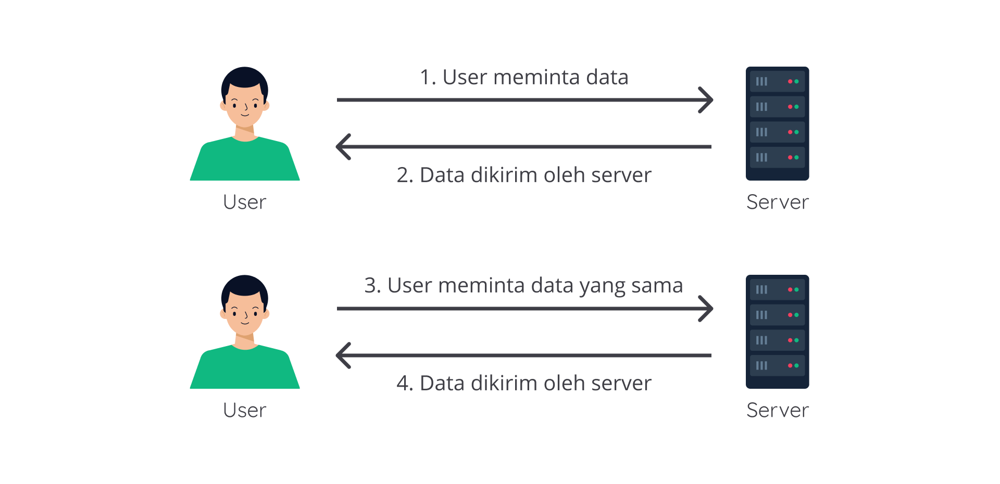

#programming 
Apa itu _web storage?_ Web storage adalah salah satu Web API (perantara agar kode JavaScript bisa "berkomunikasi" dengan _browser_) yang dapat menyimpan data secara lokal pada sisi _client_ (disimpan secara lokal pada perangkat kita). Berbeda dengan objek atau array, data yang disimpan pada objek atau array JavaScript bersifat sementara. Ia akan hilang jika terjadi _reload_ atau pergantian URL pada browser. Sedangkan data yang disimpan pada Web Storage akan bertahan lebih lama karena data tersimpan dalam storage browser.

Data yang tersimpan dalam web storage tersedia berdasarkan domain. Artinya, data pada suatu domain web hanya dapat diakses oleh domain itu sendiri. _Web storage_ dapat menampung sebesar 10MB untuk satu domain.

Pada umumnya, kita menganggap jika mengakses sebuah halaman _web_, data yang dibutuhkan akan dikirim dari _database_ milik server _web_ yang kita akses.

Tetapi tahukah Anda, bahwa tidak semua data harus diambil terus menerus dari database ketika kita mengakses halaman web tersebut? Jika proses pengambilan data dilakukan terus menerus dari database setiap kali mengakses halaman web, justru malah tidak efisien.

Karena kita mengunduh data yang sama berulang kali? Di sinilah _web storage_ memiliki kelebihan. Mari simak beberapa contoh kasus di mana _web storage_ lebih cocok digunakan:

- Menyimpan data dalam bentuk _string_ yang dihasilkan oleh sebuah halaman _web_ agar bisa diakses secara _offline_.
- Menyimpan pengaturan _preferensi_ pribadi untuk sebuah halaman _web_ contohnya seperti tata letak dan tema warna halaman _web_.

Bayangkan jika pada skenario-skenario di atas tidak menggunakan _web storage_. Kita perlu mengunduh secara terus menerus untuk data yang cenderung sama. Boros sekali, bukan? Belum lagi pengaruhnya terhadap lamanya waktu yang dibutuhkan untuk menampilkan web.
