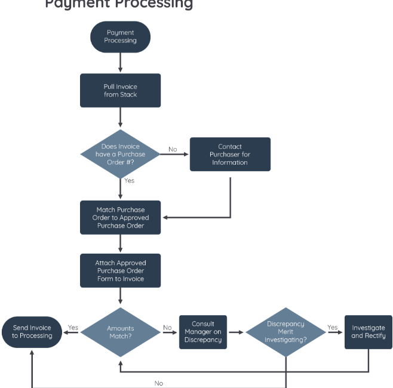

#programming #webdev 
Flowchart atau bisa disebut dengan diagram alur merupakan bentuk penggambaran dengan pendekatan visual terkait langkah-langkah dan keputusan untuk melakukan sebuah proses, alur kerja, ataupun algoritma. Setiap langkah dalam urutan proses akan digambarkan dalam bentuk diagram dan dihubungkan dengan garis atau arah panah.

Diagram alur ini juga berperan penting dalam kasus yang melibatkan banyak orang secara bersamaan dalam memutuskan sebuah langkah atau fungsionalitas yang diinginkan dari sebuah proyek. Mereka akan lebih jelas, ringkas, dan mengurangi kemungkinan untuk salah tafsir tentang langkah apa yang harus dilakukan.

Selain itu penggunaan flowchart dalam dunia pemrograman adalah sebuah cara yang bagus untuk menjembatani antara kebutuhan teknis dan non-teknis. Misalnya seseorang yang memiliki ide dalam pengembangan sebuah fitur dapat menyampaikannya dengan bahasa yang ia pahami kepada pengembang software, begitu pun sebaliknya.

### Simbol-Simbol pada Flowchart
Flowchart atau diagram alur memiliki beberapa simbol tertentu untuk mewakili fungsi atau langkahnya dalam sebuah proses. Garis dan panah menunjukkan urutan langkah dan hubungan antar blok diagram. Berikut adalah beberapa simbol yang sering dijumpai pada flowchart:

### Jenis-Jenis Flowchart yang Umum Digunakan

Tidak hanya dalam bidang pengembangan software saja, flowchart juga bisa digunakan dalam berbagai kondisi misalnya seperti mendeskripsikan alur kerja organisasi, bisnis, hubungan antar departemen dalam sebuah perusahaan, bahkan tentang kegiatan sehari-hari. Berikut merupakan beberapa jenis flowchart atau diagram alur yang populer:

#### Process Flowchart (Diagram Proses)

Diagram Proses pertama kali dikemukakan oleh Frank Gilbreth, seorang Insinyur Industri Amerika pada tahun 1920. Beberapa dekade berikutnya, diagram proses ini sering digunakan dalam bidang teknik industri dan bahkan di sektor bisnis. 

Beberapa keunggulan dari diagram proses antara lain:
- Memantau dan menganalisis dengan lebih lengkap mulai dari proses produksi hingga memeriksa kendala yang terjadi.
- Meningkatkan efisiensi dalam proses produksi.
- Meningkatkan komunikasi dan kolaborasi antar tim.
#### Workflow Flowchart (Diagram Alur Kerja)

Sebuah perusahaan pasti memiliki banyak tugas dan orang yang terlibat di dalamnya. Masing-masing orang memiliki tugas yang berbeda, bahkan bisa saja merangkap beberapa tugas sekaligus. Agar lebih mudah mengetahui alur kerja dalam perusahaan maupun bisnis, kita dapat menggunakan diagram alur kerja. Selain untuk menggambarkan tugas dari individu atau kelompok, diagram alur kerja ini juga dapat digunakan untuk sebuah proses. Sehingga diagram ini merupakan cara terbaik untuk merancang, mengubah, dan menganalisis sebuah proses bisnis.

#### Program Flowchart (Diagram Program)

Seperti namanya, diagram program dapat membantu kita untuk menggambarkan algoritma ke dalam bentuk visual. Sehingga waktu yang dibutuhkan untuk proses pemahaman akan lebih cepat dan efisien. Selain itu juga terdapat beberapa manfaat yang didapat dari diagram program berikut:

- Membantu pengembang software menemukan dan menganalisis bug dari sebuah alur proses, bahkan sebelum menjalankan aplikasinya.
- Berperan sebagai  cetak biru (_blueprint_) saat menganalisis dan mengembangkan program, sehingga penulisan kode lebih efisien.
- Meningkatkan efisiensi programmer dalam proses _maintenance_ sebuah program.
- Memudahkan komunikasi logika dari sebuah sistem kepada semua anggota tim lainnya, bahkan yang bukan pengembang software sekalipun.

